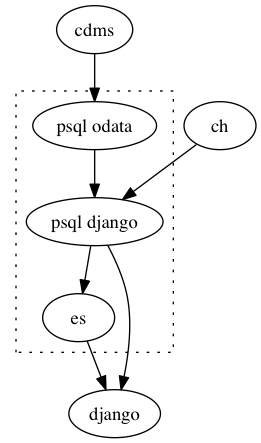

# Korben

_Korben talks to CDMS_

_Data flow in Korben_

This directory contains application code for a service offering two-way CDMS
sync. It also contains code for loading CDMS and CH data into an Elastic Search
index.

There is code forming an ETL “pipeline” for getting data to a database with a
schema that we control and a client library for “reverse ETL” allowing Django
objects to be written back to CDMS.

# [Sync](korben/sync)
Pull data from CDMS, service to poll CDMS for new data, relation traversal for
loading object dependencies. Make appropriate calls to ETL with fresh data.

# [ETL](korben/etl)
Map data from CDMS and CH schemata to our schema, populate/update Django
database and ElasticSearch index.

# [Client](korben/client)
Provide CRUD functions which talk about Django model objects, but handle
individual CDMS sync operations “behind the scenes”.
